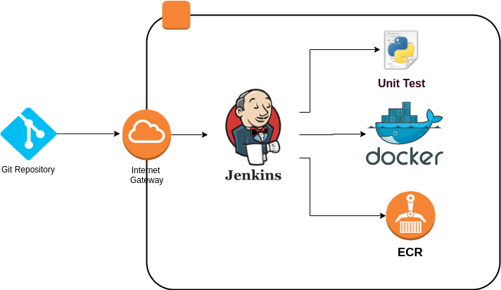
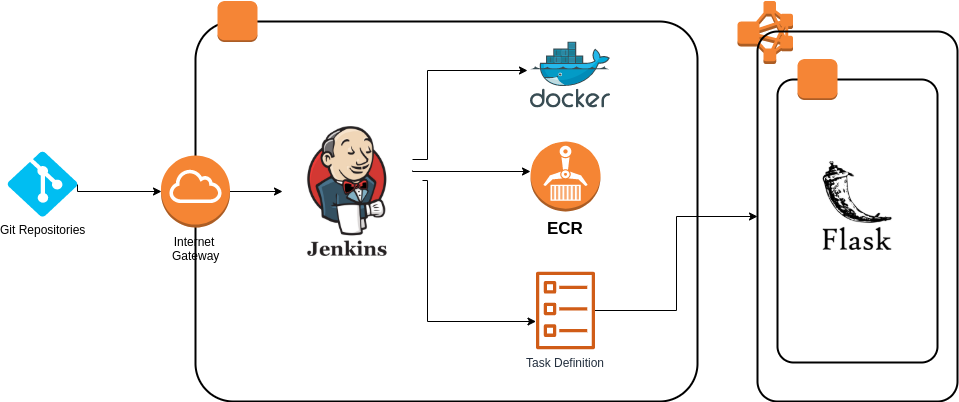

# JENKINS-FILES

> Jenkins is a free and open source automation server written in Java. Jenkins helps to automate the non-human part of the software development process, with continuous integration and facilitating technical aspects of continuous delivery. This repository contains examples of jenkins files for communication to AWS.

### **DOCKER BUILD**

> This file contains the next stages:

> - **CloneGit**: This stage contains the cloning of Github repository 
> - **Test**: This stage contains a unit test of python application
> - **Build**: This stage build an image from dockerfile
> - **Upload**: This stage uses the credentials of an AWS account to upload the previous image to ECR

### **DOCKER DEPLOY**

> This file contains the next stages:

> - **CloneGit**: This stage contains the cloning of Docker-Files and Jenkins-Files repositories from Github into different directories
> - **Build**: This stage build a framework flask image
> - **Upload**: This stage uses the credentials of an AWS account to upload the previous image to ECR
> - **Cluster**: This stage uses the credentials of an AWS account to create a task definition with the instructions to deploy the previous image in a container and the update a service to update the task inside the cluster

